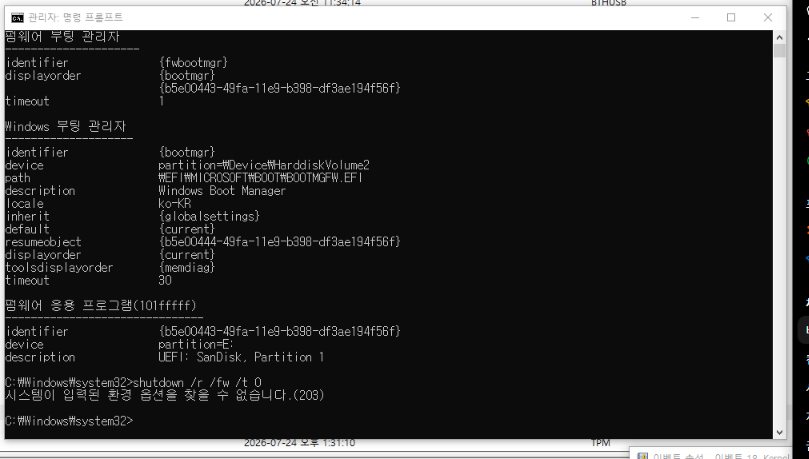
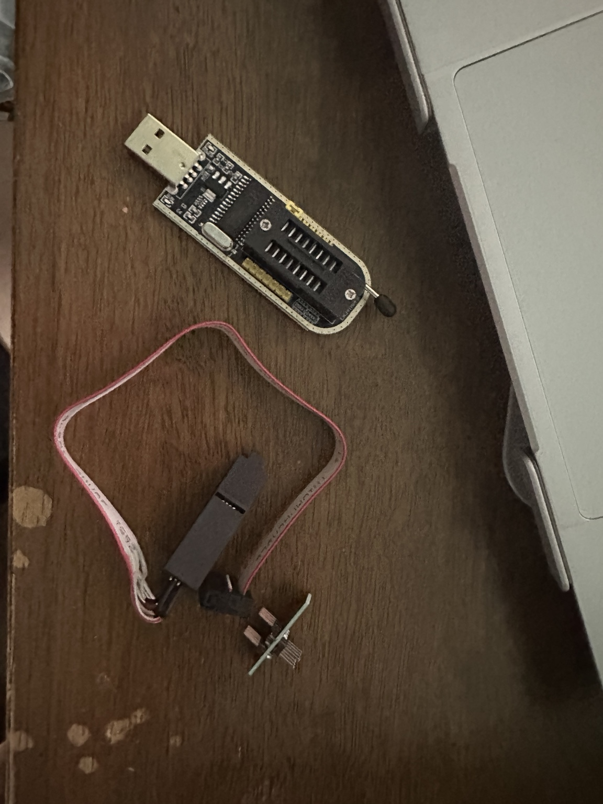
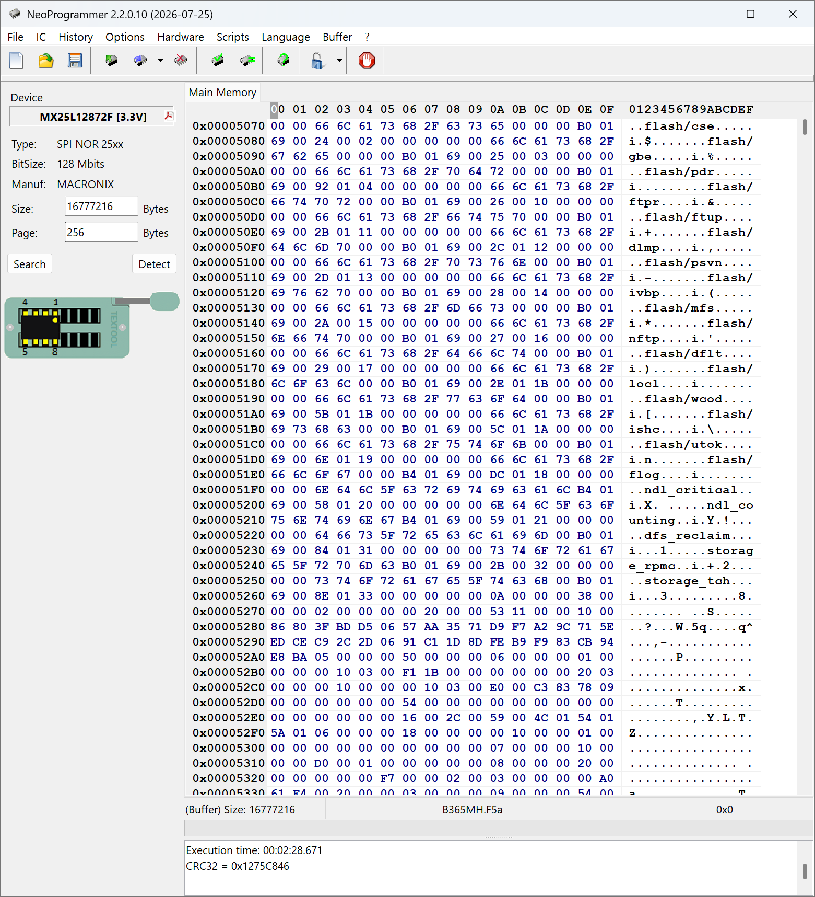
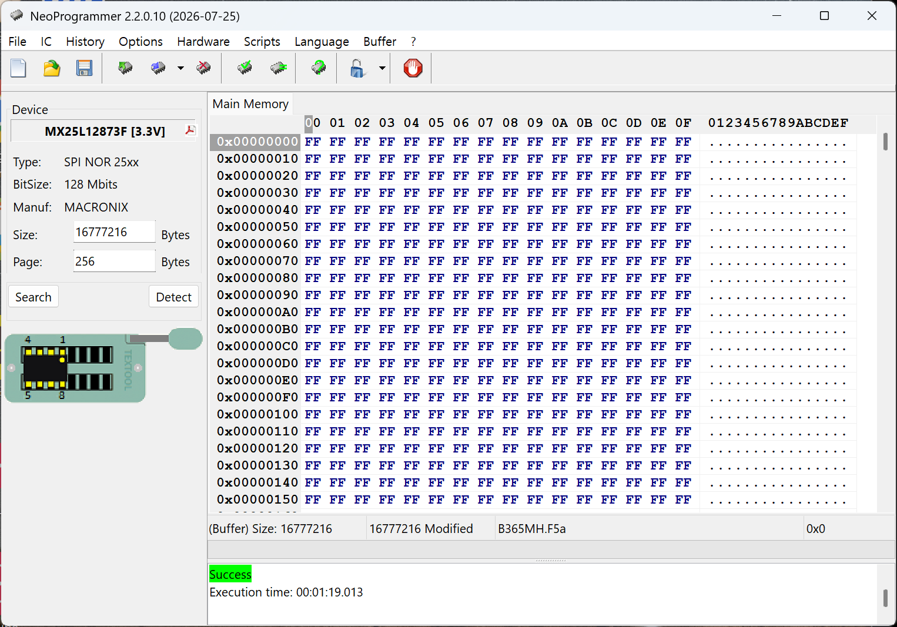

# Gigabyte B365M H BIOS/UEFI 복구 사례

Windows는 정상 부팅되지만 POST, BIOS 설정, F12 Boot Menu 및 UEFI USB 부팅이 동작하지 않던 Gigabyte B365M H Rev. 1.0을 CH341A로 복구한 기록이다.

## 결과

Macronix MX25L12872F SPI Flash에 공식 F5a BIOS를 외부 프로그래밍한 뒤 모든 펌웨어 단계 기능이 정상화되었다.

| 확인 항목 | 복구 전 | 복구 후 |
| --- | :---: | :---: |
| Gigabyte 로고 및 POST | ❌ | ✅ |
| `DEL` 키 BIOS 진입 | ❌ | ✅ |
| `F12` Boot Menu | ❌ | ✅ |
| Windows의 UEFI 펌웨어 설정 | ❌ | ✅ |
| UEFI USB 부팅 | ❌ | ✅ |
| Windows 부팅 | ✅ | ✅ |

## 문제 요약

확인된 주요 증상:

- Windows는 정상 부팅
- Gigabyte 로고와 POST 화면 미표시
- `DEL`, `F2`, `F12` 입력 무반응
- Windows 고급 시작 옵션의 UEFI 펌웨어 설정 실패
- `shutdown /r /fw /t 0` 실행 시 오류 203
- WinRE에는 `UEFI: SanDisk`가 표시되지만 USB 부팅 실패



Windows 부트 구성, WinRE, UEFI 모드와 USB 장치 탐지는 정상이었다. BIOS 업데이트와 CMOS 초기화 후 일시적으로 개선된 이력이 있어 BIOS/NVRAM 또는 SPI Flash 기록 상태를 우선 의심했다.

상세 진단 과정: **[문제 인지 및 진단 기록](docs/diagnosis.md)**

## 복구 요약

사용 장비:

- CH341A Black Edition
- SOIC8 테스트 클립
- NeoProgrammer 2.2.0.10
- Gigabyte 공식 F5a BIOS

실제 SPI Flash는 `MX25L12872F [3.3V]`, 128 Mbit였다.



복구 순서:

```text
Read original
→ Save backup
→ Erase
→ Blank 확인
→ Open BIOS image
→ Program
→ Verify
→ Read-back
```

공식 F5a 이미지와 최종 Read-back의 CRC32는 모두 `0x1275C846`이었다.



상세 작업 과정: **[CH341A BIOS 복구 기록](docs/recovery.md)**

## 작업 중 겪은 핵심 시행착오

Erase 후 빈 Flash를 확인하기 위해 `Read`를 실행하자 NeoProgrammer Buffer의 BIOS 이미지가 `FF`로 덮어써졌다.

이 상태에서 Program과 Verify를 실행했기 때문에 잘못된 빈 데이터였음에도 둘 다 `Success`가 표시되었다.



Verify는 펌웨어가 올바른지 판단하는 것이 아니라 현재 Buffer와 Flash가 일치하는지 비교한다. 따라서 Erase 후 Read했다면 BIOS 파일을 다시 열어 Buffer를 복원해야 한다.

## 최종 판단

SPI Flash 재기록 후 POST, BIOS 설정, Boot Menu와 UEFI 부팅이 함께 정상화되었다.

따라서 BIOS/NVRAM 또는 SPI Flash 기록 상태의 이상이 원인이었을 가능성이 가장 높다. 다만 손상 전후 이미지를 영역별로 분석하지 않았으므로 정확한 손상 영역과 Flash 칩 자체의 물리적 불량 여부는 확정하지 않았다.

## 문서 구성

```text
.
├─ README.md
├─ docs/
│  ├─ diagnosis.md
│  └─ recovery.md
├─ images/
│  ├─ symptom/
│  │  ├─ README.md
│  │  ├─ bcdedit-firmware-entries.png
│  │  ├─ bios-chip-location.jpeg
│  │  ├─ event-viewer-kernel-boot.png
│  │  ├─ shutdown-firmware-error-203.png
│  │  └─ system-information-uefi-bios-f5a.png
│  └─ recovery/
└─ logs/
   └─ neoprogrammer-session.log
```

- [`docs/diagnosis.md`](docs/diagnosis.md): 문제 인지, 진단 명령, 배제한 원인과 복구 전 가설
- [`docs/recovery.md`](docs/recovery.md): 사진, 작업 로그, 실패한 시도와 최종 복구 결과
- [`images/symptom/README.md`](images/symptom/README.md): 증상 이미지의 이전/새 파일명과 설명
- [`logs/neoprogrammer-session.log`](logs/neoprogrammer-session.log): NeoProgrammer 작업 로그

## 주의사항

> [!WARNING]
> CH341A 작업은 SPI Flash를 직접 읽고 쓰는 과정이다. 잘못된 전압, 반대 방향 연결, 불완전한 백업 또는 잘못된 이미지 기록은 메인보드를 부팅 불가능하게 만들 수 있다.

- 메인보드 전원과 CMOS 배터리를 분리한다.
- 칩 전압과 Pin 1 방향을 확인한다.
- 반복 Read 결과가 일치하기 전에는 Erase하지 않는다.
- 공식 이미지와 원본 덤프의 크기와 구조를 확인한다.
- Program 후 Verify와 Read-back을 모두 수행한다.
- 보드 고유 정보가 포함될 수 있는 원본 덤프는 공개하지 않는다.

## `.gitignore`

```gitignore
*.bin
*.rom
*.fd
*.cap
backups/
dumps/
```
