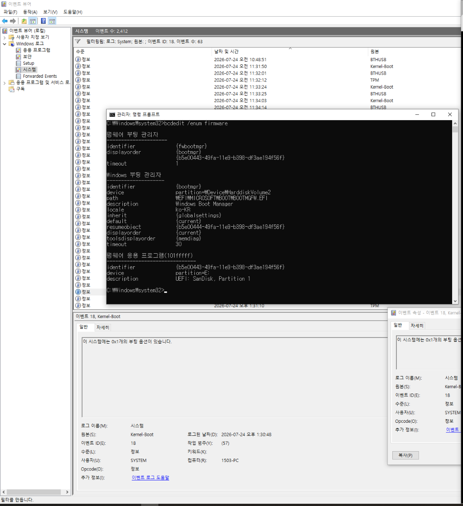
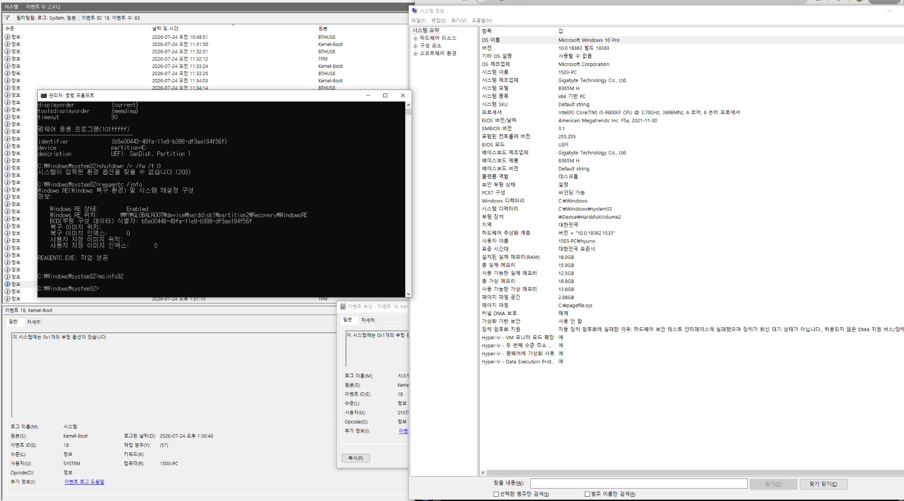
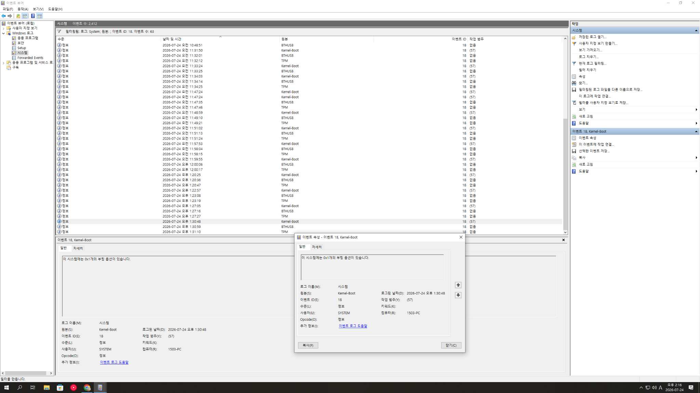
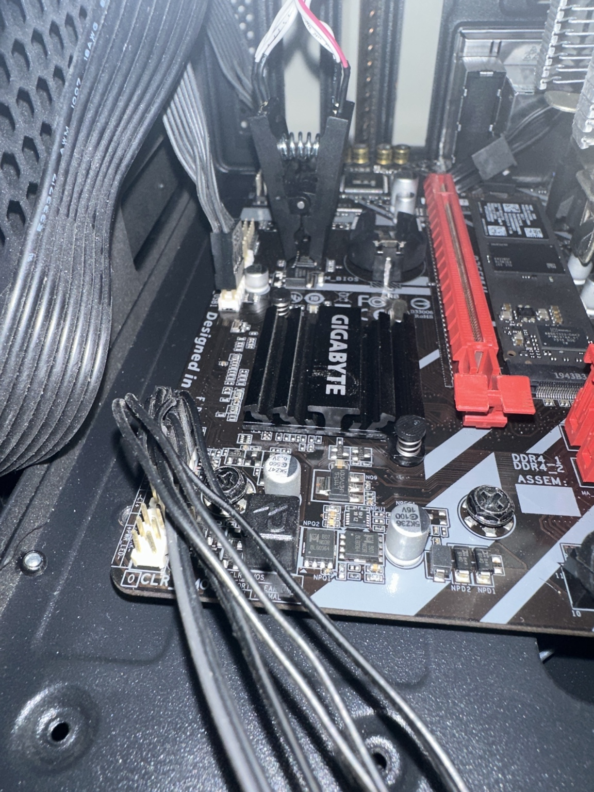

# 문제 인지 및 진단 기록

이 문서는 Gigabyte B365M H Rev. 1.0에서 Windows는 정상 부팅되지만 BIOS 설정, F12 Boot Menu 및 UEFI USB 부팅이 동작하지 않았던 문제의 인지·진단·가설 수립 과정을 기록한다.

실제 CH341A 복구 과정과 결과는 [`recovery.md`](recovery.md)에 분리했다.

## 1. 시스템 구성

| 항목 | 내용 |
| --- | --- |
| 메인보드 | Gigabyte B365M H Rev. 1.0 |
| CPU | Intel Core i5-9600KF |
| 내장 그래픽 | 없음 |
| 그래픽카드 | ASUS ROG STRIX GTX 1060 |
| 기존 BIOS | F3 |
| 문제 당시 BIOS | F5a |
| BIOS 업데이트 방법 | Gigabyte `@BIOS` |
| 부팅 방식 | UEFI |
| 운영체제 | Windows |
| SPI Flash | Macronix MX25L12872F, 128 Mbit, 3.3 V |

CPU가 `i5-9600KF`이므로 메인보드의 영상 출력 단자를 사용할 수 없다. POST와 BIOS 화면은 외장 그래픽카드의 GOP 초기화 및 출력 경로에 의존한다.

## 2. 핵심 증상

### 2.1 Windows는 정상 부팅

전원 버튼을 누르면 검은 화면이 유지되다가 Windows 로그인 화면이 나타났다. Windows 진입 후 저장장치, Windows Boot Manager, 로그인 및 일반적인 사용에는 특별한 문제가 없었다.

메인보드가 완전히 부팅 불가능한 상태는 아니었다.

### 2.2 BIOS 설정 진입 불가

전원 인가 직후 `DEL`과 `F2`를 반복 입력했지만 BIOS 설정 화면으로 진입하지 못했다.

키보드 LED에는 부팅 초기부터 전원이 들어왔다. 따라서 USB 키보드가 전혀 인식되지 않거나 특정 키 하나만 고장 난 상황일 가능성은 낮았다.

### 2.3 F12 Boot Menu 진입 불가

Gigabyte 메인보드의 `F12` Boot Menu도 나타나지 않았다. 설정 화면만 보이지 않는 것이 아니라 펌웨어 단계의 부팅 선택 메뉴에도 접근할 수 없었다.

### 2.4 Gigabyte 로고와 POST 화면 미표시

전원 인가 후 Gigabyte 로고나 POST 화면 없이 검은 화면이 유지되다가 Windows로 바로 넘어갔다.

초기에는 다음 가능성을 검토했다.

- Ultra Fast Boot 또는 Fast Boot
- 그래픽카드 GOP 초기화 문제
- 모니터 입력 전환 지연
- POST 화면 출력 문제
- 펌웨어 초기화 오류

그러나 Windows에서 요청한 UEFI 펌웨어 진입과 UEFI USB 실행까지 함께 실패했기 때문에 단순 출력 문제만으로 전체 증상을 설명하기는 어려웠다.

### 2.5 Windows의 UEFI 펌웨어 설정 실패

Windows 고급 시작 옵션에서 다음 경로를 사용했다.

```text
설정
→ 시스템 복구
→ 고급 시작 옵션
→ 문제 해결
→ 고급 옵션
→ UEFI 펌웨어 설정
```

정상적인 UEFI 시스템에서는 재부팅 후 펌웨어 설정으로 진입해야 하지만, 실제로는 BIOS 화면이 나타나지 않았다.

### 2.6 `shutdown /r /fw /t 0` 오류

관리자 명령 프롬프트에서 다음 명령을 실행했다.

```powershell
shutdown /r /fw /t 0
```

결과는 다음과 같았다.

```text
시스템이 요청된 부트 옵션을 찾을 수 없습니다. (203)
```


**이미지 설명:** `shutdown /r /fw /t 0` 실행 결과 오류 203이 발생한 화면이다. Windows가 다음 부팅에서 UEFI 설정으로 진입하도록 요청하지 못했다는 증거지만, 이 오류 하나만으로 BIOS 이미지 손상을 확정할 수는 없다.

### 2.7 UEFI USB는 표시되지만 실행 실패

Microsoft Media Creation Tool로 Windows 설치 USB를 만들었다. Windows 복구 환경의 `장치 사용` 메뉴에는 `UEFI: SanDisk`가 표시되었지만 이를 선택해도 USB로 부팅되지 않았다.

USB가 UEFI 장치로 탐지된다는 사실과 실제 부트 엔트리가 정상 실행된다는 것은 별개의 문제였다.

## 3. 문제 발생 전 이력

### 3.1 `@BIOS`를 이용한 F5a 업데이트

기존 F3 BIOS를 Gigabyte의 Windows용 `@BIOS`로 F5a에 업데이트했다.

업데이트 직후에는 BIOS 진입이 가능해졌다. 그러나 일정 시간이 지난 뒤 같은 증상이 재발했다.

BIOS 재기록 또는 그 과정에서 이루어진 설정 초기화가 증상에 영향을 주었다는 단서였지만, Windows용 업데이트만으로 상태가 안정화되지는 않았다.

### 3.2 CMOS 배터리 장착 문제

과거 CMOS 배터리를 반대 방향으로 장착했던 이력이 있었다. 방향을 바로잡고 CMOS를 초기화했을 때 BIOS 진입이 일시적으로 정상화되었지만 다시 재발했다.

CMOS 초기화는 설정값을 초기화할 뿐 SPI Flash 전체의 BIOS 펌웨어를 다시 기록하지는 않는다.

### 3.3 부팅 중 자동 재시작 정황

일부 부팅에서 시스템이 자동으로 다시 시작하는 듯한 현상이 있었다. 메모리 트레이닝, 설정 변경 또는 부팅 실패 후 복구 과정에서도 재부팅이 발생할 수 있으므로 이 현상만으로 원인을 특정하지는 않았다.

## 4. 수행한 진단

### 4.1 BIOS 진입 키 테스트

전원 인가 직후 `DEL`, `F2`, `F12`를 각각 반복 입력했다.

결과:

- BIOS 설정 진입 실패
- F12 Boot Menu 진입 실패
- POST 로고 미표시

여러 키가 같은 결과를 보였으므로 단일 키 오작동 가능성은 낮았다.

### 4.2 펌웨어 부트 항목 확인

```powershell
bcdedit /enum firmware
```



**이미지 설명:** Event Viewer와 관리자 명령 프롬프트를 함께 열고 `bcdedit /enum firmware` 결과를 확인한 화면이다. Firmware Boot Manager, Windows Boot Manager 및 UEFI USB 관련 항목이 존재했다. BCD와 펌웨어 부트 엔트리가 완전히 소실된 상태는 아니었지만, 항목의 존재만으로 펌웨어 측 실행이 정상임을 보장하지는 않는다.

### 4.3 Windows Recovery Environment 확인

```powershell
reagentc /info
```

Windows Recovery Environment가 활성화되어 있었고 복구 이미지 경로도 정상적으로 표시되었다. WinRE 손상만으로 펌웨어 진입 실패를 설명하기는 어려웠다.

### 4.4 시스템 정보 확인

`msinfo32`와 관련 명령 결과를 확인했다.



**이미지 설명:** 시스템 정보와 관리자 명령 프롬프트를 함께 확인한 화면이다. Windows는 UEFI 모드로 부팅 중이었고 BIOS 버전은 F5a였다. Legacy/MBR 설치 때문에 BIOS 진입이 실패한 상황은 아니었다.

확인된 주요 내용:

```text
BIOS 모드: UEFI
BIOS 버전: F5a
Secure Boot: 사용 안 함 또는 미구성
```

### 4.5 Windows 설치 USB 테스트

WinRE에서 USB가 `UEFI: SanDisk`로 표시되었지만 선택 후 실제 USB 부팅은 실패했다.

단순히 USB가 인식되지 않은 상황은 아니었다. 펌웨어가 해당 UEFI 부트 엔트리를 실행하거나 출력 경로를 전환하는 단계에 문제가 있을 가능성을 고려했다.

### 4.6 CMOS 초기화

다음 순서로 여러 차례 CMOS를 초기화했다.

1. PC 종료
2. 파워서플라이 스위치 OFF
3. AC 전원 케이블 분리
4. CMOS 배터리 제거
5. 전원 버튼을 눌러 잔류 전하 방전
6. 일정 시간 후 배터리 재장착
7. 시스템 재부팅

과거에는 일시적으로 개선되었지만 이후 같은 방법으로 영구 복구되지 않았다.

### 4.7 Event Viewer 확인



**이미지 설명:** Windows Event Viewer에서 Kernel-Boot 관련 이벤트와 세부 정보를 확인한 화면이다. 대부분 정보성 이벤트였으며 BIOS 진입 불가를 직접 설명하는 명확한 오류는 발견하지 못했다. 문제 발생 지점이 Windows 커널 로드 이전의 펌웨어 단계라면 Windows 로그만으로 원인을 찾는 데 한계가 있다.

### 4.8 TPM 상태 확인

TPM은 정상 준비 상태였다. TPM이 부팅을 차단하거나 펌웨어 진입을 방해한 정황은 확인되지 않았다.

### 4.9 BIOS 칩 위치 확인



**이미지 설명:** 그래픽카드를 제거해 BIOS 칩 주변에 접근할 수 있도록 한 Gigabyte B365M H의 모습이다. 기존 `M_bios.jpg`는 GitHub에서 2바이트의 빈 파일로 확인되어, 실제 보드 사진으로 교체했다.

## 5. 가능성이 낮아진 원인

### 5.1 Windows 설치 손상

Windows는 정상 부팅되었고 WinRE도 활성 상태였다.

### 5.2 BCD의 완전한 손상

Firmware Boot Manager, Windows Boot Manager와 UEFI USB 관련 항목이 존재했다.

### 5.3 단순 USB 제작 실패

USB가 UEFI 장치로 표시되었고 BIOS 및 F12 진입도 동시에 실패했다. USB 하나만의 문제로 전체 증상을 설명하기 어려웠다.

### 5.4 단일 키 또는 키보드 고장

키보드 전원이 들어왔고 여러 진입 키가 같은 결과를 보였다.

### 5.5 Secure Boot 차단

Secure Boot를 사용하지 않는 상태였다.

### 5.6 TPM 문제

TPM은 정상 준비 상태였다.

## 6. 진단 단계의 주요 가설

### 6.1 BIOS 이미지 일부 손상

`@BIOS` 업데이트 후 일시적으로 정상화되었다가 재발했다. 펌웨어 일부가 불완전하게 기록되었거나 특정 영역이 손상되었을 가능성을 고려했다.

### 6.2 NVRAM 영역 이상

CMOS 초기화 후 일시적으로 개선된 이력이 있었다. UEFI 부트 변수와 설정을 저장하는 NVRAM 영역의 데이터 이상 가능성을 고려했다.

### 6.3 SPI Flash 기록 상태 또는 칩 이상

SPI Flash의 특정 섹터에 쓰기 또는 보존 문제가 있다면 재기록 직후 정상화되었다가 다시 재발할 수 있다.

### 6.4 그래픽카드 GOP 또는 POST 출력 문제

CPU에 내장 그래픽이 없어 외장 GPU 출력에 의존한다. 다만 UEFI USB 실행과 Windows의 펌웨어 진입 요청도 함께 실패했으므로 출력 문제만으로 모든 증상을 설명하기는 어려웠다.

### 6.5 메인보드의 기타 하드웨어 문제

- SPI Flash 전원 공급 이상
- 칩셋 또는 Super I/O 초기화 문제
- 보드 전원 회로 문제
- 펌웨어 리셋 회로 문제

외부 재기록 이후에도 증상이 유지된다면 이 가능성의 우선순위가 높아질 예정이었다.

## 7. CH341A를 선택한 이유

일반적인 복구 경로는 다음과 같다.

- CMOS 초기화
- Q-Flash
- Windows용 BIOS 업데이트
- USB BIOS Flashback
- DualBIOS 복구

그러나 현재 BIOS 설정과 Q-Flash에 접근할 수 없었고, 이 모델에는 전용 USB BIOS Flashback 버튼도 없다.

따라서 메인보드의 SPI Flash를 직접 읽고 재기록할 수 있는 CH341A와 SOIC8 클립을 사용하기로 했다.

## 8. 진단 단계의 결론

Windows 부트 구성, WinRE, UEFI 모드와 USB 장치 탐지에는 뚜렷한 이상이 없었다. 반면 POST, BIOS 설정, Boot Menu, Windows의 펌웨어 진입 요청과 UEFI USB 실행은 모두 실패했다.

또한 BIOS 업데이트와 CMOS 초기화 후 일시적으로 정상화된 이력이 있었다.

따라서 복구 전에는 다음 순서로 원인을 의심했다.

1. BIOS 펌웨어 또는 NVRAM 영역 이상
2. SPI Flash의 불완전한 기록
3. SPI Flash 칩 자체의 부분 불량
4. 메인보드의 펌웨어 초기화 관련 하드웨어 문제
5. 그래픽카드 GOP 또는 POST 출력 문제

이 시점에서는 가설일 뿐 최종 원인은 확정하지 않았다. 이후 CH341A 재기록으로 모든 펌웨어 단계 기능이 정상화된 과정은 [`recovery.md`](recovery.md)에 기록했다.
