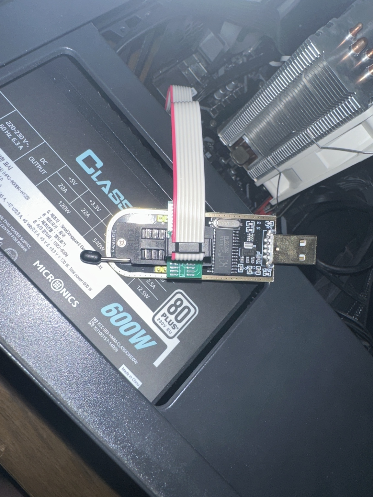
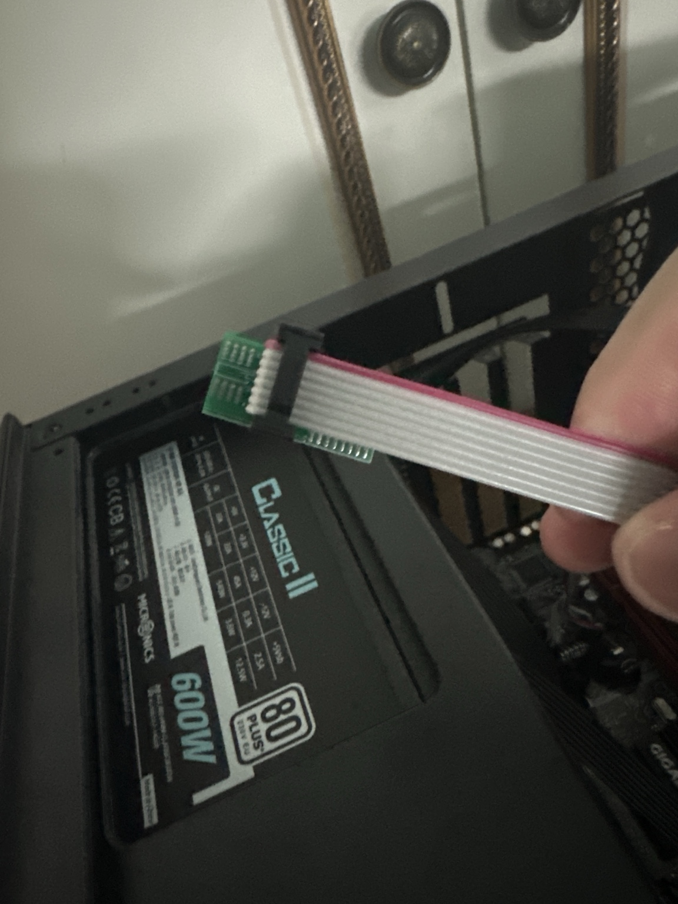
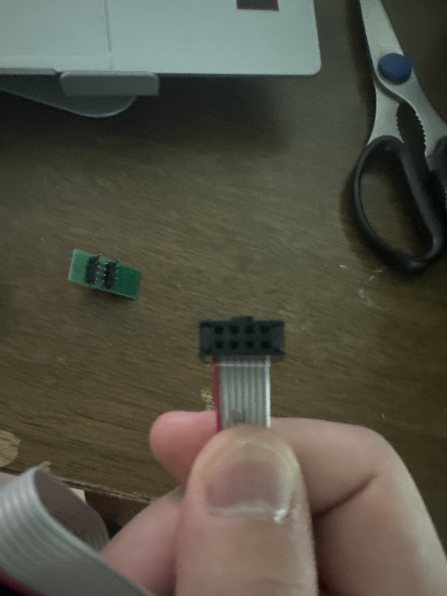
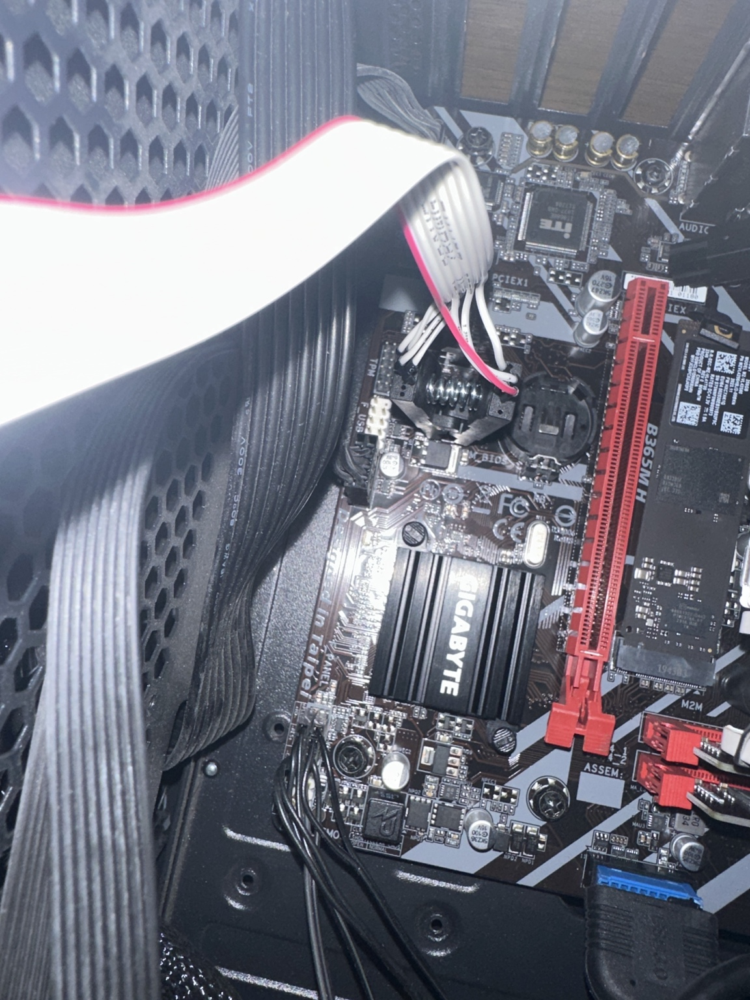
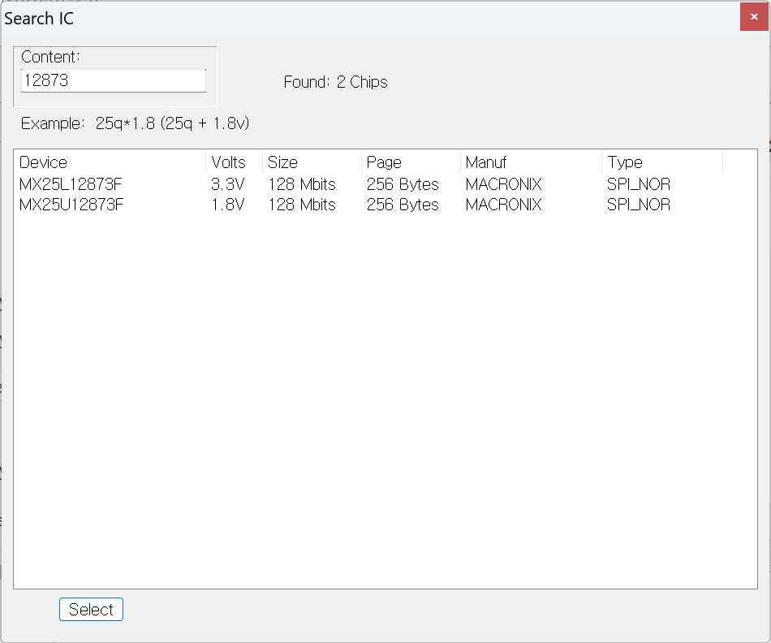
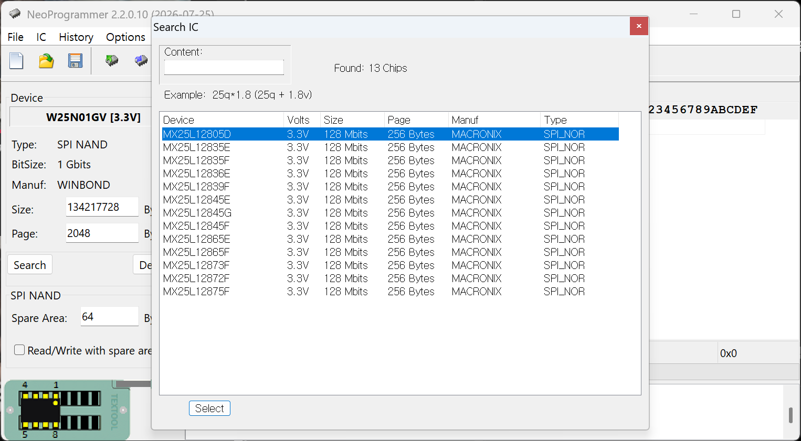
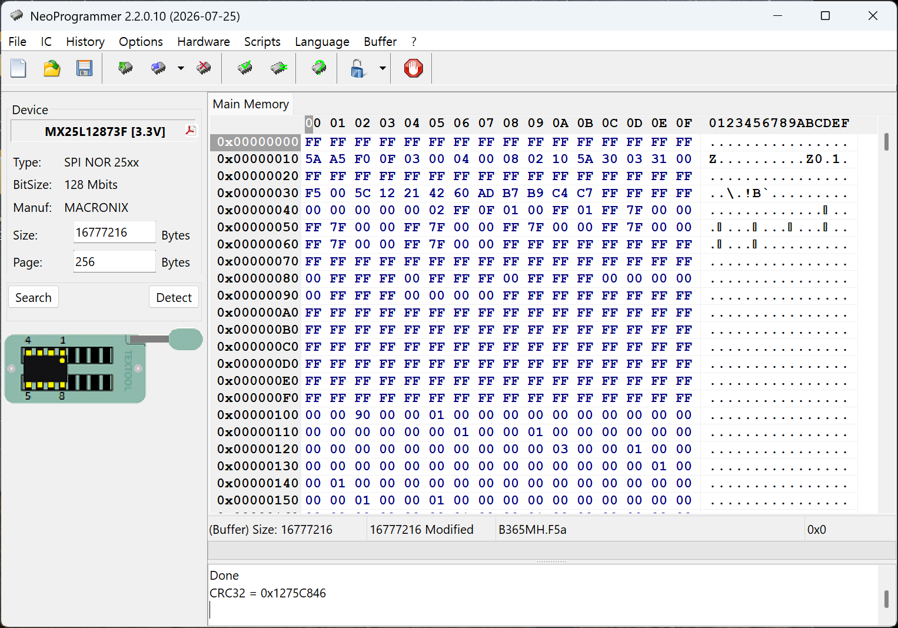
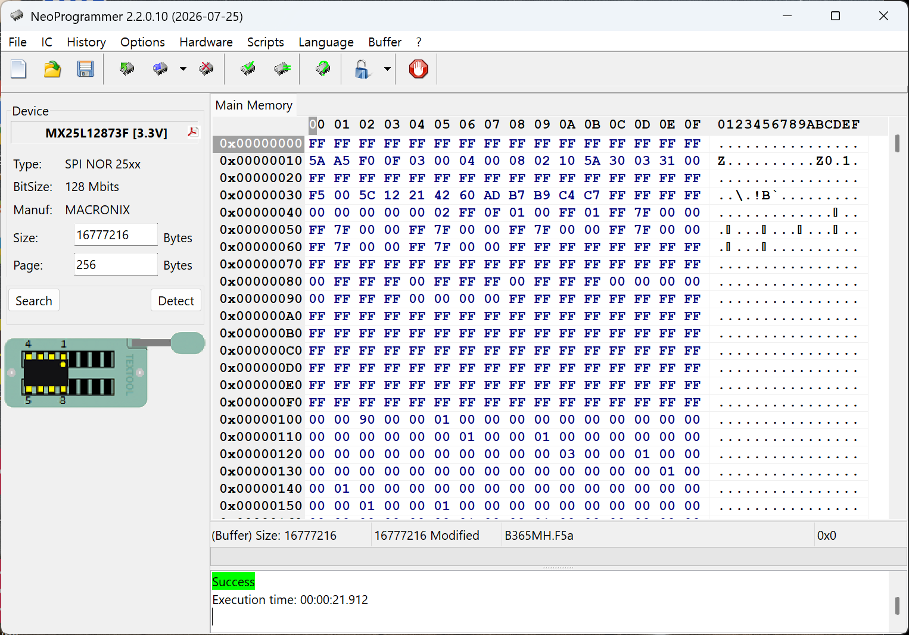
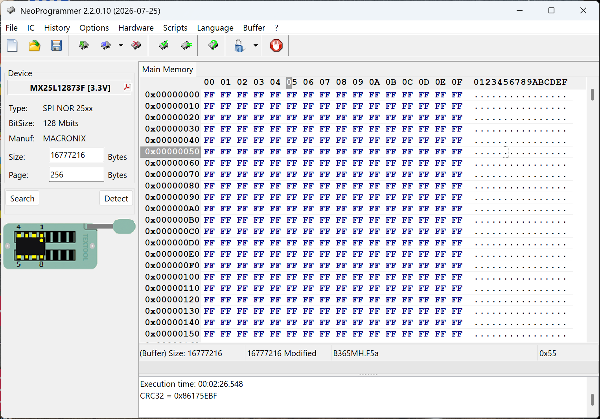
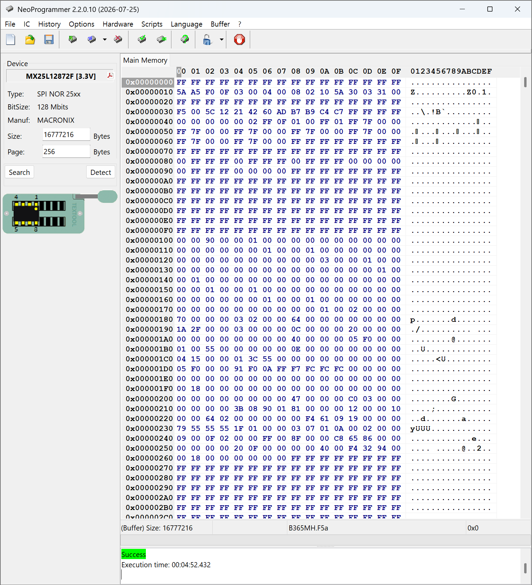

# CH341A BIOS 복구 작업 기록

이 문서는 [`diagnosis.md`](diagnosis.md)에서 수립한 가설을 검증하기 위해 CH341A로 Gigabyte B365M H의 SPI Flash를 직접 재기록한 과정, 실제 로그와 시행착오를 기록한다.

## 1. 최종 결과

CH341A Black Edition과 SOIC8 테스트 클립을 사용해 Macronix MX25L12872F를 재기록했다.

공식 F5a BIOS 이미지와 최종 Read-back의 CRC32가 `0x1275C846`으로 일치했으며 POST, BIOS 설정, F12 Boot Menu, UEFI USB 부팅 및 Windows 부팅이 모두 정상화되었다.

| 확인 항목 | 복구 전 | 복구 후 |
| --- | :---: | :---: |
| Gigabyte 로고 및 POST | ❌ | ✅ |
| `DEL` 키 BIOS 진입 | ❌ | ✅ |
| `F12` Boot Menu | ❌ | ✅ |
| Windows의 UEFI 펌웨어 설정 | ❌ | ✅ |
| UEFI USB 부팅 | ❌ | ✅ |
| Windows 부팅 | ✅ | ✅ |

## 2. 사용 장비와 소프트웨어

- CH341A Black Edition
- SOIC8 테스트 클립과 연결 케이블
- NeoProgrammer 2.2.0.10
- 별도 Windows PC
- Gigabyte B365M H Rev. 1.0용 공식 F5a BIOS


## 3. 작업 전 안전 조치

메인보드와 프로그래머에서 동시에 전원을 공급하면 장비나 보드를 손상할 수 있다.

다음 순서로 준비했다.

1. Windows 정상 종료
2. 파워서플라이 스위치 OFF
3. AC 전원 케이블 분리
4. CMOS 배터리 제거
5. 케이스 전원 버튼을 10~15초 눌러 잔류 전하 방전
6. 그래픽카드 제거
7. 칩 마킹과 Pin 1 확인
8. SOIC8 클립 연결
9. CH341A를 별도 PC에 연결

## 4. CH341A와 SOIC8 연결



CH341A의 25xx 소켓 위치와 어댑터 방향을 확인했다.



리본 케이블의 빨간 선은 Pin 1 방향을 표시한다.



프로그래머, 어댑터, 리본 케이블과 클립의 Pin 1이 모두 같은 방향으로 이어지는지 확인했다.



그래픽카드를 제거해 공간을 확보한 뒤 BIOS 칩의 여덟 핀에 클립을 연결했다.

## 5. 칩 모델 선택 과정

실제 SPI Flash는 Macronix `MX25L12872F`, 128 Mbit, 3.3 V였다.

처음에는 마킹을 `MX25L12873F`로 잘못 읽어 검색했다.



검색 결과에 3.3 V와 1.8 V 항목이 함께 나타나 전압 선택을 고민했다. 1.8 V 항목을 잘못 선택하면 칩이나 프로그래머에 문제가 생길 수 있으므로 작업을 중단하고 마킹을 다시 확인했다.



전체 목록에서 정확한 `MX25L12872F [3.3V]` 항목을 찾았다. 최종 작업은 대체 모델이 아니라 이 정확한 항목으로 진행했다.

Detect 시 확인한 SPI ID는 `C22018`이었다.

## 6. 처음 발생한 연결 문제

처음에는 NeoProgrammer에서 칩이 응답하지 않았다.

소프트웨어나 칩 불량을 의심하기 전에 SOIC8 클립을 분리하고 다시 장착했다. 클립 위치를 조정한 뒤 칩이 정상적으로 Detect되었다.

이 경험으로 인서킷 프로그래밍에서 가장 먼저 확인할 항목은 다음이라는 점을 알 수 있었다.

- 메인보드와 CMOS 배터리가 완전히 분리되었는지
- Pin 1 방향이 맞는지
- 여덟 핀이 모두 접촉하는지
- 클립이 칩이 아닌 주변 부품을 함께 물고 있지 않은지

## 7. 원본 BIOS 읽기와 백업

Erase 전에 기존 내용을 먼저 읽고 백업했다.

가능하다면 같은 연결 상태에서 여러 번 읽은 뒤 해시를 비교해야 한다.

```powershell
Get-FileHash .\dump_01.bin -Algorithm SHA256
Get-FileHash .\dump_02.bin -Algorithm SHA256
Get-FileHash .\dump_03.bin -Algorithm SHA256
```

반복 덤프가 일치하지 않으면 Erase하지 않고 다음을 점검한다.

- 클립 접촉
- 칩 모델 선택
- Pin 1 방향
- 주변 회로 간섭
- SPI Flash 자체 불량

원본 덤프에는 UUID, 시리얼, MAC 관련 정보와 보드 고유 데이터가 들어 있을 수 있으므로 공개 저장소에는 올리지 않는다.

## 8. 공식 F5a 이미지 확인

NeoProgrammer에서 Gigabyte 공식 F5a BIOS 이미지를 열었다.



확인된 값:

```text
Buffer size: 16,777,216 bytes
CRC32: 0x1275C846
```

Hex 및 ASCII 영역에 데이터가 표시되는지 확인했다.

공식 업데이트 파일은 항상 전체 SPI 이미지와 같은 구조라고 단정할 수 없으므로 다음 항목을 확인하는 것이 안전하다.

- 공식 이미지와 원본 덤프의 크기
- Intel Flash Descriptor 포함 여부
- Intel ME Region 포함 여부
- BIOS Region만 제공되는지 여부
- 캡슐 헤더 존재 여부
- 보드 고유 데이터 보존 여부

## 9. Erase와 Blank 확인

원본 백업을 확보한 뒤 Flash를 Erase했다.



Erase 후 Blank 상태를 확인하기 위해 Read를 실행했다.



전체가 `FF`로 표시되었고 CRC32는 `0x86175EBF`였다. 이는 16 MiB Flash가 빈 상태임을 나타냈다.

## 10. 가장 중요한 시행착오

### 10.1 발생한 실수

공식 BIOS를 Buffer에 연 상태에서 다음 순서로 작업했다.

```text
Open BIOS
→ Erase
→ Read
→ Program
```

문제는 `Read`가 Flash 내용을 NeoProgrammer Buffer로 가져오는 작업이라는 점이었다.

Erase 직후 Read를 실행하자 빈 Flash의 `FF` 데이터가 Buffer의 공식 BIOS 이미지를 덮어썼다. 이 상태에서 Program을 실행해 `FF`를 Flash에 다시 기록했다.


NeoProgrammer에는 `Success`가 표시되었지만 화면의 Buffer는 여전히 `FF`였다.

### 10.2 Verify까지 성공한 이유

Verify는 “올바른 BIOS인지” 판단하는 기능이 아니다. 현재 Buffer와 Flash가 같은지를 비교한다.

Buffer와 Flash가 모두 `FF`였기 때문에 잘못된 내용을 기록했음에도 Program과 Verify가 모두 성공했다.

로그에서도 최종 Read의 CRC32가 빈 Flash와 같은 `0x86175EBF`로 나타났다.

### 10.3 수정한 작업 순서

Erase 뒤 Blank 확인을 위해 Read했다면 BIOS 이미지를 다시 열어야 한다.

```text
Read original
→ Save backup
→ Erase
→ Blank 확인
→ Open BIOS image again
→ Program
→ Verify
→ Read-back
```

## 11. 실제 작업 로그

정리된 원문 로그: [`../logs/neoprogrammer-session.log`](../logs/neoprogrammer-session.log)

| 시각 | 작업 | 결과 | 해석 |
| --- | --- | --- | --- |
| 13:13:01 | Erase | 성공 | Flash 삭제 |
| 13:13:10 | Erasure control | 성공 | Blank 상태 검사 |
| 13:16:08 | Read | 성공 | 빈 Flash의 `FF`가 Buffer를 덮어씀 |
| 13:18:52 | Program | 성공 | `FF` Buffer를 기록한 잘못된 시도 |
| 13:20:29 | Verify | 성공 | Flash와 `FF` Buffer가 서로 일치 |
| 13:23:00 | Read | 성공 | CRC32 `0x86175EBF`, 여전히 빈 상태 |

로그는 성공 메시지를 작업 성공으로 곧바로 해석하면 안 된다는 것을 보여준다.

## 12. 올바른 Program과 Verify

공식 F5a 이미지를 다시 열어 Buffer CRC32가 `0x1275C846`인지 확인한 뒤 Program과 Verify를 실행했다.



Program과 Verify가 성공한 뒤에도 바로 재조립하지 않고 최종 Read-back을 실행했다.

## 13. 최종 Read-back


Read-back 결과:

- 전체가 `FF`가 아니었음
- `flash/cse`, `flash/gbe`, `storage` 등의 ASCII 문자열 확인
- CRC32 `0x1275C846`
- 공식 F5a 이미지의 CRC32와 일치

이 결과로 공식 BIOS 이미지가 실제 Flash에 기록되었다고 판단했다.

## 14. 재조립과 첫 부팅

1. CH341A USB 분리
2. SOIC8 클립 제거
3. CMOS 배터리 재장착
4. 그래픽카드 장착
5. 전원과 모니터 연결
6. 첫 부팅에서 충분히 대기
7. POST 확인
8. `DEL`로 BIOS 진입
9. Load Optimized Defaults 적용
10. 부팅 순서와 저장장치 확인
11. Windows 및 UEFI USB 부팅 확인

첫 부팅에서는 펌웨어 초기화와 메모리 트레이닝 때문에 평소보다 오래 걸리거나 재부팅될 수 있다.

## 15. 복구 검증

| 작업 또는 기능 | 결과 |
| --- | :---: |
| SPI Flash Detect | 성공 |
| 원본 Read 및 백업 | 성공 |
| Erase | 성공 |
| Program | 성공 |
| Verify | 성공 |
| Read-back CRC 일치 | 성공 |
| POST 화면 | 정상 |
| BIOS 설정 진입 | 정상 |
| F12 Boot Menu | 정상 |
| UEFI USB 부팅 | 정상 |
| Windows 부팅 | 정상 |

## 16. 최종 판단

SPI Flash 재기록 후 펌웨어 단계의 기능들이 함께 정상화되었다.

따라서 Windows, WinRE 또는 BCD보다는 BIOS/NVRAM이나 SPI Flash 기록 상태의 이상이 원인이었을 가능성이 가장 높다.

다만 손상 전후 덤프를 영역별로 비교해 특정 섹터나 바이트를 규명하지는 않았다. 다음과 같이 결론 내리는 것이 정확하다.

> BIOS/NVRAM 또는 SPI Flash 기록 상태의 이상이 가장 유력하며, CH341A 외부 재기록으로 문제가 해결되었다. 정확한 손상 영역과 SPI Flash 칩 자체의 물리적 불량 여부는 확정하지 않았다.

같은 증상이 빠르게 재발하거나 반복 Read·Erase·Program·Verify가 불안정해진다면 SPI Flash 칩 자체의 불량을 추가로 의심해야 한다.

## 17. 배운 점

- Windows 정상 부팅과 BIOS/UEFI 정상 동작은 별도로 판단해야 한다.
- CMOS 초기화는 설정을 초기화할 뿐 손상된 BIOS 이미지를 복구하지 않는다.
- 전압과 Pin 1 방향을 확인하기 전에는 프로그래머를 연결하지 않는다.
- 칩 이름을 추측하지 말고 표면 마킹과 소프트웨어 목록을 다시 확인한다.
- 정확한 모델이 목록에 있다면 대체 모델보다 정확한 모델을 사용한다.
- 원본 덤프를 확보하고 검증하기 전에는 Erase하지 않는다.
- NeoProgrammer의 Read는 기존 Buffer를 덮어쓴다.
- Erase 후 Read했다면 Program 전에 BIOS 이미지를 다시 연다.
- Program과 Verify의 Success만으로 올바른 BIOS가 기록됐다고 단정하지 않는다.
- 최종 Read-back과 CRC 또는 해시 비교까지 수행한다.
- BIOS 원본 덤프는 공개 저장소에 올리지 않는다.
